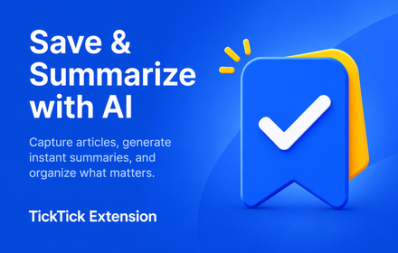
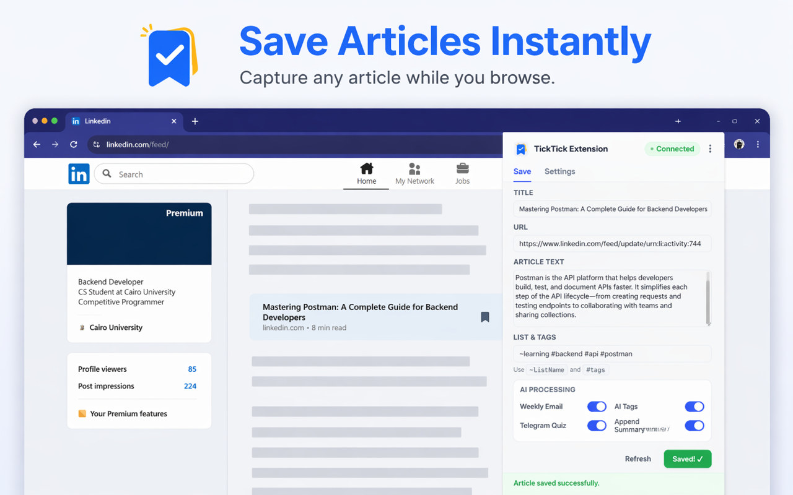
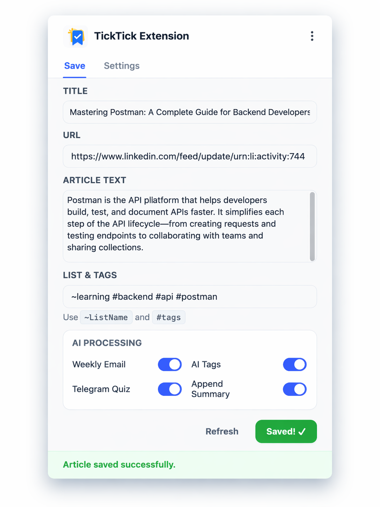

# TickTick Extension 🚀

<p align="center">
  
</p>

<p align="center">
  <b>Turn Articles Into Smart Knowledge</b><br>
  Save • Summarize • Organize • Learn Again
</p>

<p align="center">
  
  
  
  
</p>

---

# 📌 Part 1 — Product & Business Vision

## 🌍 Overview

TickTick Extension is an AI-powered Chrome Extension + Backend API that helps users save useful online content and transform it into structured, reusable knowledge.

Instead of losing valuable articles inside bookmarks, tabs, or saved posts, users can instantly turn any article into:

- AI Summary
- Smart Tags
- Quiz Questions
- TickTick Tasks
- Weekly Digest Emails
- Telegram Learning Quizzes

This project combines **AI, productivity, automation, and knowledge management** into one complete workflow.

---

## ❌ The Problem

People consume valuable content every day:

- Blog posts
- LinkedIn posts
- Tutorials
- Technical documentation
- Research articles
- Threads

But in most cases they:

- forget what they read
- never revisit saved content
- lose important insights
- keep messy bookmarks
- gain no long-term value from reading

So reading becomes temporary instead of useful.

---

## ✅ The Solution

TickTick Extension transforms passive reading into active learning.

With one click, users can:

- save an article instantly
- generate an AI summary
- generate relevant tags
- generate a quiz for retention
- create a TickTick task automatically
- receive weekly reminders later

This means every useful article becomes something organized, searchable, and worth revisiting.

---

## 💼 Business Value

### For Developers

Save technical resources and revisit them later with summaries and quizzes.

### For Students

Turn learning materials into reviewable content.

### For Professionals

Build a personal second brain from daily reading.

### For Productivity Users

Convert useful content into actionable tasks.

---

# 🖼 Product Preview

## Hero Banner

<p align="center">
  
</p>

---

## Save Articles While Browsing

<p align="center">
  
</p>

---

## Extension Popup UI

<p align="center">
  
</p>

---

## 🔥 Main Features

### 📥 Smart Capture

- Save any page instantly
- Capture title and URL
- Capture article or selected text
- Fast popup workflow

### 🧠 AI Engine

- AI summary generation
- smart tag generation
- quiz generation for retention
- structured content enrichment

### ✅ TickTick Sync

- OAuth login
- account connection
- automatic task creation

### 📧 Weekly Digest

- email reminders
- saved content recap
- better long-term retention

### 🤖 Telegram Bot

- quiz delivery
- weekly learning notifications
- re-engagement flow

---

## 🧠 Why This Project Is Strong

This is not a basic CRUD project.

It solves a real problem using multiple integrated systems:

- browser extension engineering
- backend API architecture
- OAuth integration
- AI content processing
- automation workflows
- notification systems
- knowledge retention features

This project demonstrates both **technical depth** and **real product thinking**.

---

# ⚙️ Part 2 — Technical Section

## 🛠 Tech Stack

### Frontend
- HTML
- CSS
- JavaScript
- Chrome Extension APIs
- Manifest V3

### Backend
- Node.js
- Express.js

### Database
- MongoDB
- Mongoose

### AI
- Groq API
- Llama Models

### Integrations
- TickTick OAuth2
- Telegram Bot API
- Nodemailer

### Automation
- node-cron

---

## 🔐 Engineering Concepts Used

- RESTful API Design
- Modular Architecture
- Async Error Handling
- Validation Layers
- OAuth2 Flow
- Secure Token Handling
- MongoDB Schema Design
- Scheduled Jobs
- Webhooks
- Environment Variables

---

## 🚀 Technical Challenges Solved

- Chrome extension to backend communication
- OAuth redirect flow handling
- user identity persistence
- AI response parsing
- scheduled weekly automations
- Telegram webhook deployment
- content processing pipeline consistency

---

## 📂 Suggested Project Structure

```text
TickTick_Extension/
│── client/
│   ├── popup.html
│   ├── popup.js
│   ├── styles.css
│   └── manifest.json
│
│── server/
│   ├── routes/
│   ├── controllers/
│   ├── models/
│   ├── middlewares/
│   ├── utils/
│   └── app.js
│
│── assets/
│   ├── hero-banner.png
│   ├── banner-main.png
│   ├── live-preview.png
│   └── popup-ui.png
│
│── README.md
```

---

## 📡 Example Workflow

1. User opens an article while browsing
2. User clicks the extension
3. The extension captures title, URL, and article text
4. Backend receives the content
5. AI generates summary, tags, and quiz
6. Data is saved in MongoDB
7. A TickTick task can be created
8. Content can later appear in weekly email or Telegram quiz

---

## 📈 Future Improvements

- dashboard for saved knowledge
- search across stored content
- spaced repetition engine
- recommendations based on saved topics
- analytics for learning activity
- multi-user workspace
- mobile app support

---

## 👨‍💻 Author

**Ahmed Sheref**

Backend Developer building real systems with business value.

GitHub: [Ahmed-Sheref](https://github.com/Ahmed-Sheref)

---

# ⭐ Final Statement

Most people read and forget.

**TickTick Extension helps users read once and keep the value forever.**
